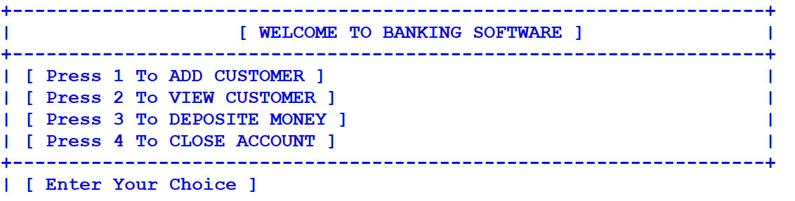
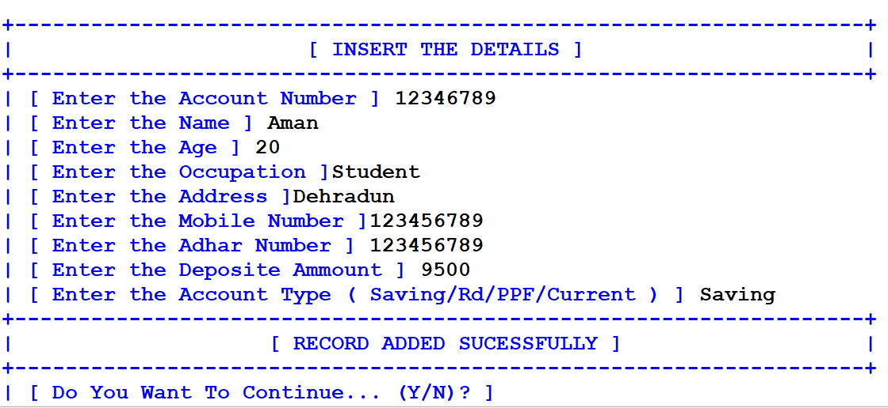
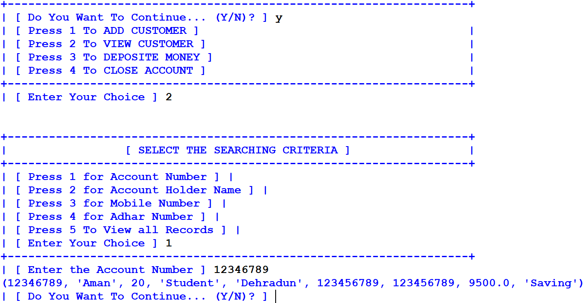
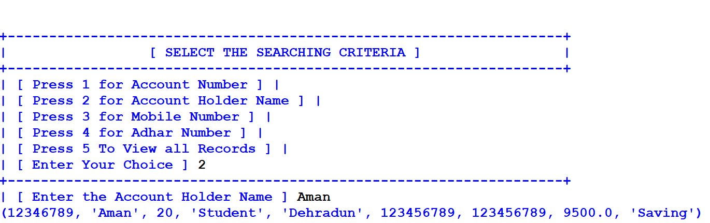
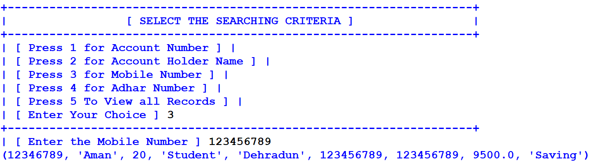
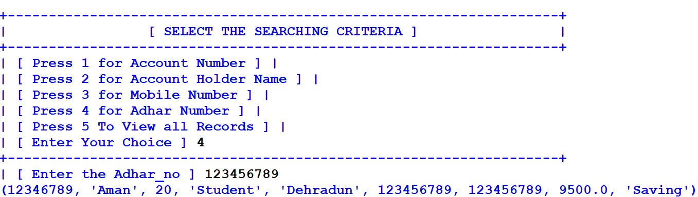
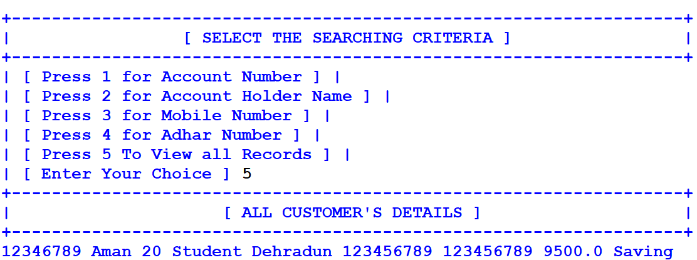
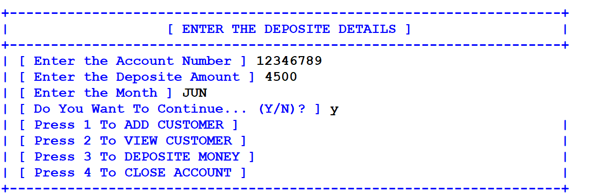
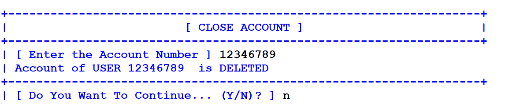

# Banking System Software

A console-based banking application written in Python that connects to a MySQL database to manage account records. It allows us to create customer accounts, search records using various criteria, deposit money, and close/delete accounts.

---

## Features

* **Add Customer**: Input and store details such as Account Number, Name, Age, Occupation, Address, Mobile Number, Aadhaar Number, Account Type (Saving/Rd/PPF/Current), and Initial Deposit.
* **Search Customer**: Query using multiple search options:
  * By Account Number
  * By Account Holder's Name
  * By Mobile Number
  * By Aadhaar Number
  * View All Customer Records
* **Deposit Money**: Record money deposits into accounts for a specific month.
* **Close Account**: Permanently remove account records and transaction logs from the database.

---

## Database Configuration

The application connects to a local MySQL instance with the following settings (defined in [bank_.py]
* **Host**: `localhost`
* **User**: `root`
* **Password**: `""` (empty)
* **Database Name**: `bank_py`

---

## Screenshots

### Application Menu

### Adding Customer Records

### Search by Account Number

### Search by Account Holder Name

### Search by Mobile Number

### Search by Aadhaar Number

### Viewing Whole Database

### Depositing Money

### Closing an Account

