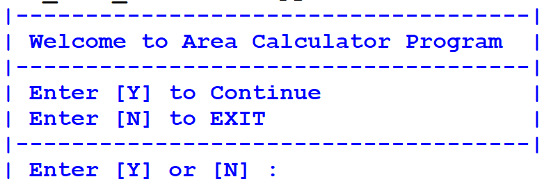
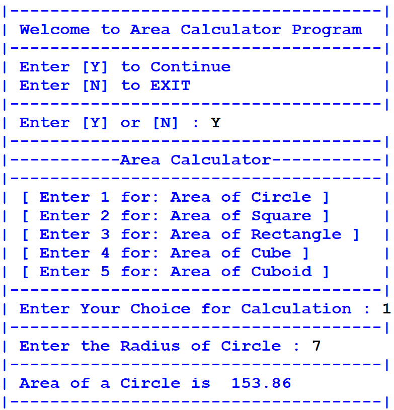
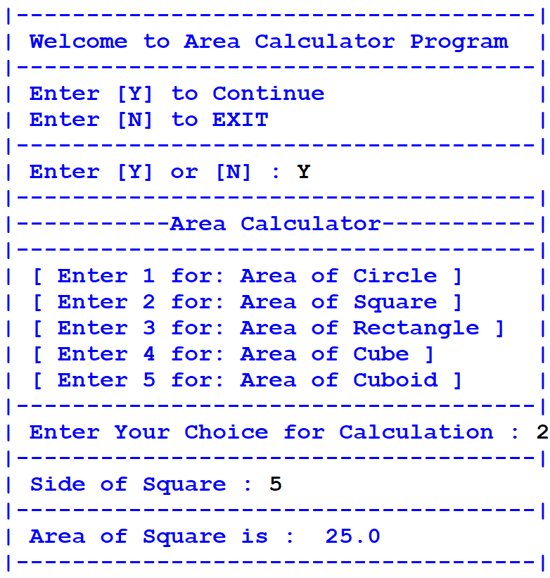
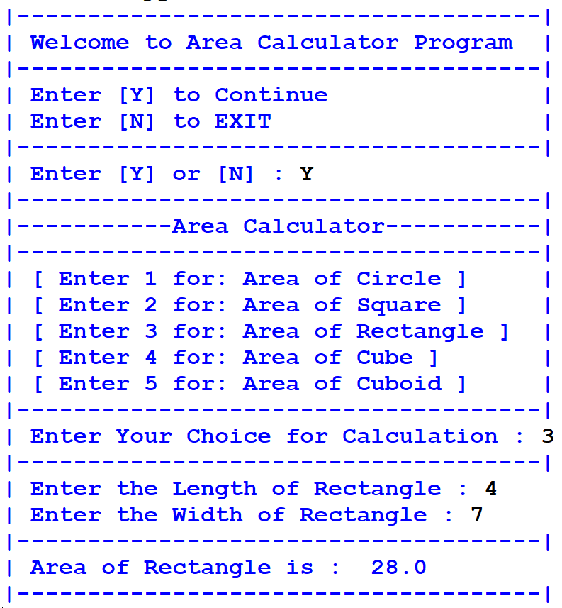
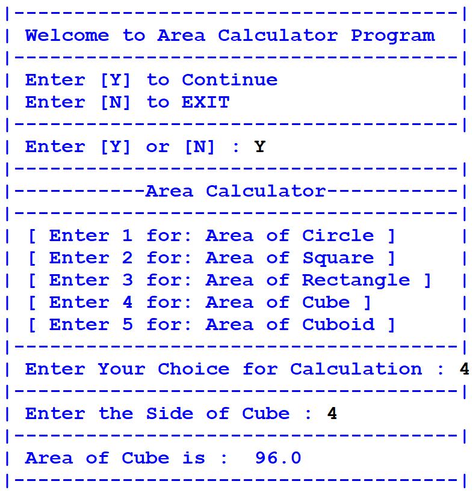
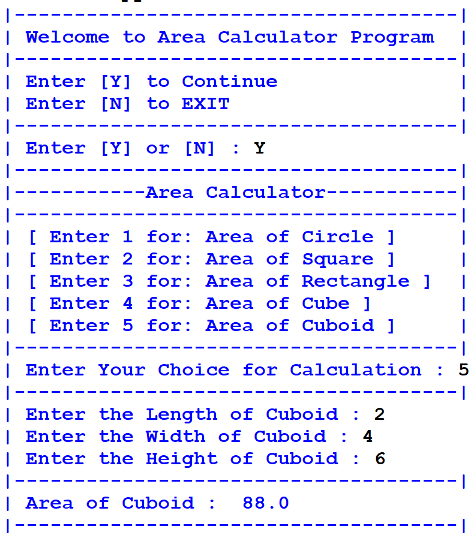
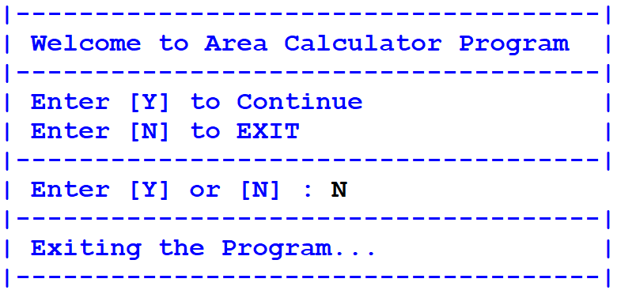

# Area Calculator Program

A command-line program in Python to quickly calculate the areas of common geometric shapes, including both 2D and 3D shapes.

---

## Supported Calculations

1. **Area of a Circle**: \(\pi \times r^2\)
2. **Area of a Square**: \(s^2\)
3. **Area of a Rectangle**: \(l \times w\)
4. **Surface Area of a Cube**: \(6 \times s^2\)
5. **Surface Area of a Cuboid**: \(2 \times (lw + wh + hl)\)

---

## How it Works

1. Run the script:
   ```bash
   python basic_area_calculator.py
   ```
2. Enter `Y` to continue.
3. Select the shape number (1–5).
4. Enter the required dimensions (radius, side length, etc.).
5. The program outputs the calculated area instantly.

---

## Screenshots

Below are screenshots demonstrating the application's CLI interface:








