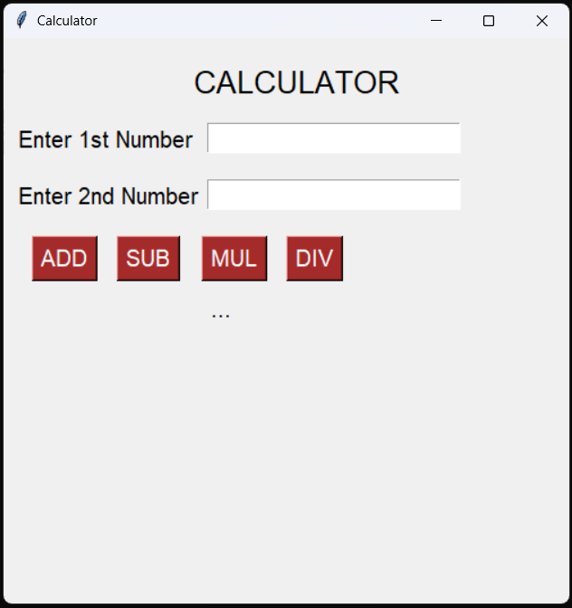
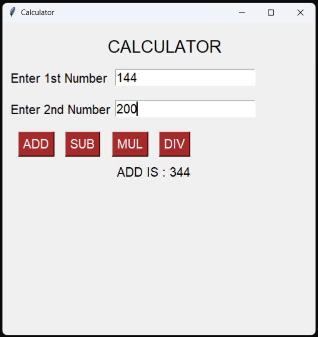
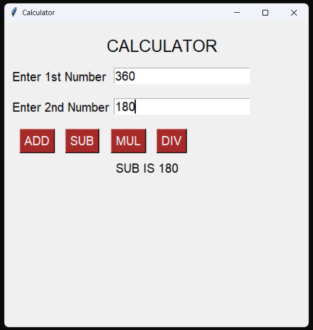
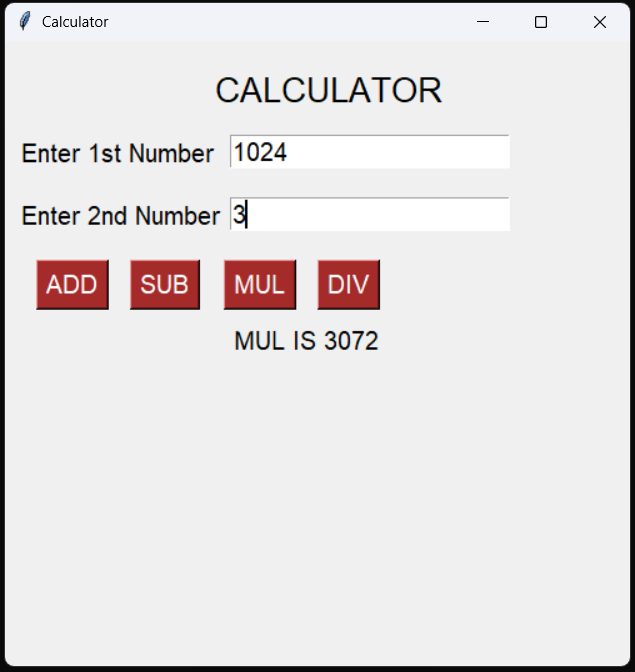
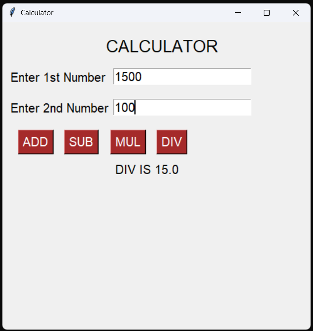

# GUI Calculator Program

A graphical desktop calculator program built in Python using the `tkinter` library. It provides a simple, interactive user interface to perform basic arithmetic operations on two numbers.

---

## Supported Calculations

1. **ADD**: Performs addition (\(a + b\))
2. **SUB**: Performs subtraction (\(a - b\))
3. **MUL**: Performs multiplication (\(a \times b\))
4. **DIV**: Performs division (\(a \div b\))

---

## How it Works

1. Run the script:
   ```bash
   python calc_gui.py
   ```
2. Enter the first number in the **Enter 1st Number** field.
3. Enter the second number in the **Enter 2nd Number** field.
4. Click on any of the calculation buttons: **ADD**, **SUB**, **MUL**, or **DIV**.
5. The result will be dynamically displayed below the buttons.

---

## Screenshots

Below are screenshots demonstrating the application's GUI interface for various calculations:

### Main Interface


### Addition (ADD)


### Subtraction (SUB)


### Multiplication (MUL)


### Division (DIV)


